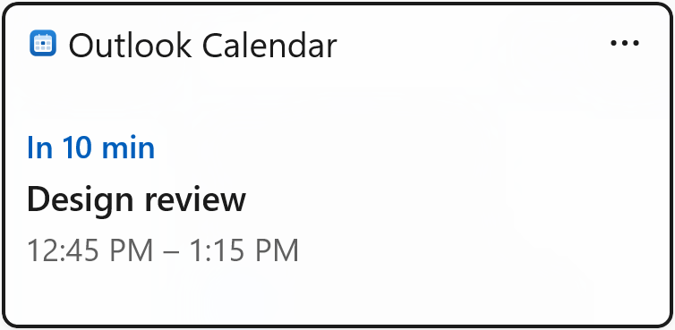
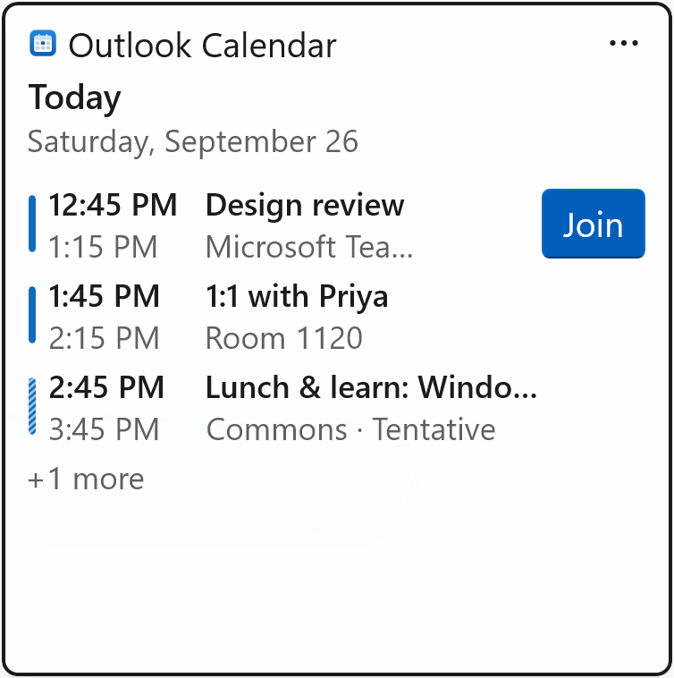
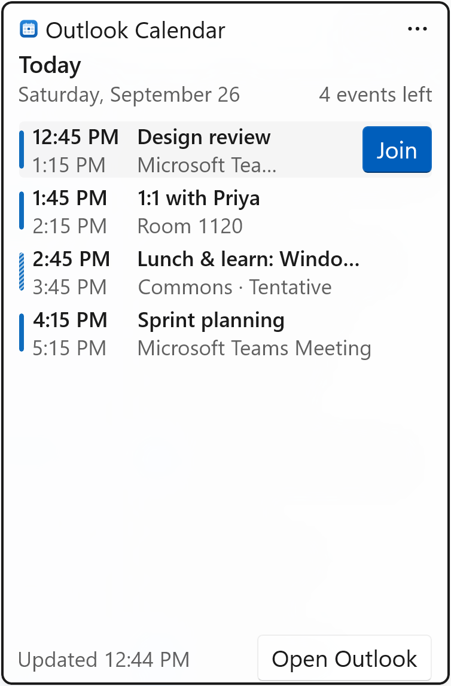

# Outlook Calendar Widget

[](https://github.com/az-pz/outlook-calendar-widget/actions/workflows/ci.yml)
[](https://github.com/az-pz/outlook-calendar-widget/releases/latest)
[](LICENSE)

Your Outlook calendar on the Windows 11 Widgets board (<kbd>Win</kbd>+<kbd>W</kbd>). It reads your meetings straight from classic Outlook on your PC, with no sign-in and no cloud calls. It can also read them from Microsoft 365 or Outlook.com through Microsoft Graph.

| Small | Medium | Large |
| :---: | :---: | :---: |
|  |  |  |

<sub>Screenshots use the built-in sample events.</sub>

## Features

- **Three sizes:**
  - **Small:** your next meeting with a countdown ("In 10 min").
  - **Medium:** up to 3 upcoming events.
  - **Large:** up to 6 upcoming events, plus an *Open Outlook* button.
- **Agenda details:** color bars show free, busy, tentative, and out-of-office time, and the meeting in progress is highlighted. Each event shows its location and your response (tentative, not responded, or declined). Long events such as week-long OOF blocks show as *All day*.
- **Join button** for Teams and other online meetings. It appears 15 minutes before the start and stays until the meeting ends.
- **One-tap open.** Tap an event to open it in Outlook. With the *Outlook on this PC* source, the exact occurrence opens in classic Outlook.
- **Per-widget settings** (widget **⋯** menu > **Customize widget**):
  - Show events for today, today and tomorrow, or the next 7 days.
  - Show or hide all-day events and declined meetings.
- **Companion app** (WinUI 3 with Mica and a light or dark theme) for picking the calendar source, previewing today's agenda, refreshing, and signing in to Microsoft 365.

## Requirements

- Windows 11 22H2 (build 22621) or later, on an x64 or Arm64 PC.
- For the default calendar source: **classic Outlook for Windows** (Microsoft 365 Apps or Office), signed in and running.

## Install

1. From the [latest release](https://github.com/az-pz/outlook-calendar-widget/releases/latest), download `OutlookCalendarWidget_<version>_x64.zip`, or `…_arm64.zip` on an Arm PC (for example, Snapdragon).
2. Extract it, open PowerShell in the extracted folder, and run:

   ```powershell
   powershell -ExecutionPolicy Bypass -File .\install.ps1
   ```

   The script does the following:

   1. Trusts the package's self-signed certificate (`OutlookCalendarWidget.cer`) on this PC. The first time, Windows asks for administrator approval.
   2. Installs the Windows App Runtime from the zip's `Dependencies` folder if it's missing.
   3. Installs the app for your Windows account.
   4. Restarts the Widgets host so the widget shows up.
3. Press <kbd>Win</kbd>+<kbd>W</kbd>, select **+** (Add widgets), and pin **Outlook Calendar**.
4. Use the widget's **⋯** menu to resize or customize it.
5. Optionally, open **Outlook Calendar Widget** from Start to choose a different calendar source.

**To update,** run `install.ps1` from the new release's zip, or open the new `.msix`. Your settings are kept.

<details>
<summary>Install without the script</summary>

1. If you don't have the [Windows App Runtime](https://learn.microsoft.com/windows/apps/windows-app-sdk/downloads) 2.5.1 or later, open `Dependencies\Microsoft.WindowsAppRuntime.2.msix` from the zip.
2. In an administrator PowerShell, trust the certificate:

   ```powershell
   Import-Certificate -FilePath .\OutlookCalendarWidget.cer -CertStoreLocation Cert:\LocalMachine\TrustedPeople
   ```

3. Open `OutlookCalendarWidget_<version>_<arch>.msix` and select **Install**.

</details>

**Verifying a download:** every release lists SHA-256 hashes in `SHA256SUMS.txt`, and each file has a build provenance attestation. With the [GitHub CLI](https://cli.github.com/):

```powershell
gh attestation verify OutlookCalendarWidget_<version>_x64.zip --repo az-pz/outlook-calendar-widget
```

### Build from source

You need Developer Mode (Settings > System > For developers), the [.NET 10 SDK](https://dotnet.microsoft.com/download/dotnet/10.0), and the [Windows App Runtime](https://learn.microsoft.com/windows/apps/windows-app-sdk/downloads) 2.5.1 or later for your architecture. If a release is installed, uninstall it first; both use the same package identity.

```powershell
git clone https://github.com/az-pz/outlook-calendar-widget.git
cd outlook-calendar-widget
.\scripts\deploy.ps1 -Configuration Release
```

`deploy.ps1` does the following:

1. Checks that Developer Mode is on.
2. Stops the widget provider and the Widgets host, which lock the build output.
3. Builds for this PC's architecture.
4. Checks for the Windows App Runtime.
5. Registers the build output as a loose-file MSIX package, so no certificate is needed.
6. Restarts the Widgets host so it picks up the change.

Then pin the widget as described above.

> [!IMPORTANT]
> The installed app runs directly from the build output folder (`src\OutlookCalendarWidget\bin\…`). If you delete that folder or run `dotnet clean`, run `deploy.ps1` again.

Other options: `-Platform x64|ARM64`, `-Configuration Debug|Release` (the default is Debug), `-GraphClientId <id>` (see [Microsoft 365 setup](#microsoft-365-or-outlookcom-setup)), and `-NoWidgetsRestart`. To update, pull the latest changes and run the script again.

## Calendar sources

Choose a source in the companion app under **Calendar source**.

| Source | How it works | Setup |
| --- | --- | --- |
| **Outlook on this PC** (default) | Reads the default calendar of classic Outlook through its COM object model. Your calendar data never leaves the PC. | Keep classic Outlook running. |
| **Microsoft 365 or Outlook.com** | Reads your default calendar from Microsoft Graph, even when Outlook is closed. Sign-in uses the Windows account broker (WAM), so accounts already signed in to Windows get single sign-on. | Needs a Microsoft Entra app registration ([see below](#microsoft-365-or-outlookcom-setup)). |
| **Sample events** | Made-up meetings for trying out the widget. | None. |

### When Outlook isn't running

The widget never starts Outlook in the background.

- **Outlook closes after the widget has read your calendar:** the widget keeps showing the last agenda it read. The *Updated* time shows how old it is.
- **Outlook isn't running and nothing has been read yet:** the widget shows an **Open Outlook** button.
- **Either way,** the widget checks again every minute and updates once Outlook is back.
- **Only the new Outlook for Windows is running:** the widget explains that it can't read it. The new Outlook has no COM object model for other apps. To use it, switch to the *Microsoft 365 or Outlook.com* source.

### Microsoft 365 or Outlook.com setup

This source needs the application (client) ID of an Entra app registration. The registration must be a public client with the delegated `Calendars.Read` permission and the redirect URI `ms-appx-web://microsoft.aad.brokerplugin/<client-id>`. To create one with the [Azure CLI](https://learn.microsoft.com/cli/azure/install-azure-cli):

```powershell
az login --allow-no-subscriptions
.\scripts\register-entra-app.ps1        # prints the client ID; add -WhatIf to preview
```

Next, select the *Microsoft 365 or Outlook.com* source. Open **Microsoft Graph connection**, paste the client ID, save, and select **Sign in**. If you build from source, you can instead bake the ID in with `.\scripts\deploy.ps1 -GraphClientId <id>`.

With this source, tapping an event opens it in Outlook on the web. The **"Open Outlook" link** setting controls where *Open Outlook* goes. The default is `https://outlook.office.com/calendar/view/day`; Outlook.com users can change it to `https://outlook.live.com/calendar/`.

## Refreshing

| Source | Board open | Board closed |
| --- | --- | --- |
| Outlook on this PC | every 2 minutes | every 5 minutes |
| Microsoft 365 or Outlook.com | every 5 minutes | every 15 minutes |

- Countdowns and the in-progress highlight update every minute without fetching anything.
- The widget fetches immediately when you open the board and its data is more than 2 minutes old, and when you change settings or select **Refresh** in the companion app.
- While classic Outlook is unavailable or a read fails, the widget retries every minute.

## Privacy

- **Outlook on this PC:** the widget reads your calendar locally and sends the card only to the Windows Widgets host on this PC. It reads only fields that Outlook's object-model guard doesn't protect (such as subject, time, location, and response status). As a result, it never triggers Outlook's "A program is trying to access…" prompt.
- **Microsoft 365 or Outlook.com:** the only network calls go to Microsoft sign-in and to `graph.microsoft.com` (read-only `Calendars.Read`). Windows keeps the refresh tokens in its account broker. The app stores only account metadata, encrypted with DPAPI.
- **Nothing else is sent anywhere.** There's no telemetry.
- **Where data is stored:** settings and logs live in `%LOCALAPPDATA%\Packages\OutlookCalendarWidget_tt1wz9sd5daxr\LocalState`. The diagnostics log never records meeting details.

## Limitations

- **Only your default calendar** is shown. Shared calendars, group calendars, and other calendars aren't included.
- **Up to 7 days ahead** and up to 500 events per refresh.
- **The new Outlook for Windows** can only be used through the *Microsoft 365 or Outlook.com* source.
- **Not in the Microsoft Store.** Releases are signed with a self-signed certificate, so installing one means trusting that certificate on your PC.
- **Interface text is English only.** Dates and times follow your Windows regional format.

## Troubleshooting

- **The widget isn't in the picker, or still shows the old version after an update.** The Widgets host caches widget providers. Run `install.ps1` (or `deploy.ps1`) again, or end *Windows Widgets* (`WidgetBoard.exe` and `WidgetService.exe`) in Task Manager, then press <kbd>Win</kbd>+<kbd>W</kbd>.
- **Opening the `.msix` fails with a certificate or trust error, or asks for the Windows App Runtime.** Run `install.ps1` from the release zip; it sets up both.
- **`install.ps1` says a development build is registered.** A build from source and a release can't be installed side by side. Remove the development build (see [Uninstall](#uninstall)) and run the script again.
- **"Classic Outlook isn't running", but Outlook is open.** You're using the new Outlook. Turn off the **New Outlook** toggle in its top-right corner to go back to classic Outlook, or use the Microsoft 365 source.
- **"Couldn't connect to Outlook".** Outlook is probably running as administrator. Restart it normally; Outlook and the widget have to run at the same integrity level.
- **"Outlook isn't responding".** An Outlook dialog, such as a profile or password prompt, is blocking other apps. Close it, and the widget recovers on its own.
- **Anything else:** check `…\LocalState\logs\diagnostics.log`, which is in the folder listed under [Privacy](#privacy). It records provider starts, refresh results with timings, and errors.

## Development

```powershell
dotnet test --project tests\OutlookCalendarWidget.Core.Tests                               # unit tests
dotnet build src\OutlookCalendarWidget\OutlookCalendarWidget.csproj -p:Platform=x64         # build only (x64 or ARM64)
.\scripts\deploy.ps1                                                                        # build, register and restart Widgets
```

CI runs the tests and builds x64 and ARM64 for every push and pull request.

**Releasing.**

1. Bump `Version` in [`Package.appxmanifest`](src/OutlookCalendarWidget/Package.appxmanifest) (keep the last part at `0`) and commit.
2. Tag the commit and push the tag:

   ```powershell
   git tag -a v1.2.0 -m "Outlook Calendar Widget 1.2.0"
   git push origin v1.2.0
   ```

The [Release workflow](.github/workflows/release.yml) then does the following:

1. Checks that the tag matches the manifest version.
2. Runs the tests.
3. Builds self-contained x64 and ARM64 MSIX packages, which bundle .NET but not the AI, ML, and Search parts of the Windows App SDK.
4. Signs and timestamps the packages.
5. Installs each release zip with `install.ps1` on x64 and Arm64 runners and starts the widget provider.
6. Publishes the release with `SHA256SUMS.txt` and build provenance attestations.

Running the workflow by hand from the Actions tab does everything except publishing. Use it to try the packages from the run's artifacts first.

The signing certificate is self-signed with the subject `CN=OutlookCalendarWidget Dev`, which must match `Publisher` in the manifest. It lives in the `release` environment's `MSIX_CERTIFICATE_PFX_BASE64` and `MSIX_CERTIFICATE_PASSWORD` secrets, and only `main` and `v*` tags can use that environment. If you replace the certificate, users have to trust the new one, which `install.ps1` does.

**How it works.** One executable plays three roles:

```
OutlookCalendarWidget.exe
 ├─ -RegisterProcessAsComServer         → COM widget provider, started by the Widgets host
 ├─ outlook-calendar-widget:open?id=…   → opens an event in classic Outlook, then exits (no window)
 └─ anything else                       → single-instance WinUI 3 companion app
```

- **Widget provider** (`Widgets/`): an out-of-process COM server that implements `IWidgetProvider` and `IWidgetProvider2` from the Windows App SDK. It renders [Adaptive Card templates](src/OutlookCalendarWidget.Core/Templates) with JSON data from `AgendaBuilder`.
- **Outlook access** (`Services/OutlookDesktop.cs`):
  - Uses late-bound COM, so no Office interop assemblies are needed.
  - Calls `Items.Restrict` with recurrences expanded.
  - Gets Teams join links from the `SkypeTeamsMeetingUrl` property.
- **Microsoft Graph** (`GraphCalendarClient.cs`, `Services/AuthService.cs`): calls `/me/calendarView`, using MSAL with the WAM broker for sign-in.
- **Shared state:** the app and the provider share `settings.json` in the package's `LocalState` folder, and signal each other through a named event.
- **Core library** (`src/OutlookCalendarWidget.Core`): platform-independent, unit-tested logic for agenda building, Outlook and Graph mapping, card data, and templates.

**Debugging the provider.**

- **Start it without the board:**

  ```powershell
  [Activator]::CreateInstance([Type]::GetTypeFromCLSID('E5BF83A9-075E-4D20-80B4-B4EF2B16017C'))
  ```

  Then attach a debugger to `OutlookCalendarWidget.exe`, or watch the diagnostics log.
- **Crashes** appear in Event Viewer under *Windows Logs > Application*, from the .NET Runtime and Application Error sources.
- **Build error `PRI210 … 0x800704c8`:** the Widgets host has the package's `resources.pri` open. `deploy.ps1` stops the host first. If you build some other way, close Widgets first.

**Assets.**

- `.\scripts\generate-assets.ps1` regenerates the app and widget icons from vector primitives.
- To regenerate the Widgets picker screenshots, run `npm install` and then `npm run render` in `scripts\widget-preview`. The renderer uses the official Adaptive Cards renderer in Microsoft Edge.

**Tech stack:**

- .NET 10 and C# (latest version) with nullable references, analyzers, and warnings treated as errors.
- WinUI 3 and Windows App SDK 2.5 (only the components the app uses), packaged as a single-project MSIX.
- Adaptive Cards templating.
- MSAL.NET with the WAM broker.
- xUnit v3 on Microsoft Testing Platform.
- Central package management and a `.slnx` solution.
- GitHub Actions for CI and for signed releases with build provenance attestations.

```
src/OutlookCalendarWidget/        WinUI 3 app + widget provider (MSIX)
src/OutlookCalendarWidget.Core/   Platform-independent logic and Adaptive Card templates
tests/                            Unit tests
scripts/                          Release installer, dev deploy, Entra app registration, icon and screenshot generators
docs/images/                      README screenshots
```

## Uninstall

1. Unpin the widget (**⋯** > **Unpin widget**).
2. Run:

   ```powershell
   Get-AppxPackage OutlookCalendarWidget | Remove-AppxPackage
   ```

This also deletes the app's settings, logs, and cached account data. To also remove the Entra app registration, delete it in the Microsoft Entra admin center.

If you installed a release, you can also remove its certificate from an administrator PowerShell:

```powershell
Get-ChildItem Cert:\LocalMachine\TrustedPeople | Where-Object Subject -eq 'CN=OutlookCalendarWidget Dev' | Remove-Item
```

## License

[MIT](LICENSE) © 2026 Ariz Zubair.

This is a personal project, not an official Microsoft product. Outlook, Microsoft 365, Windows, and Teams are trademarks of the Microsoft group of companies.
